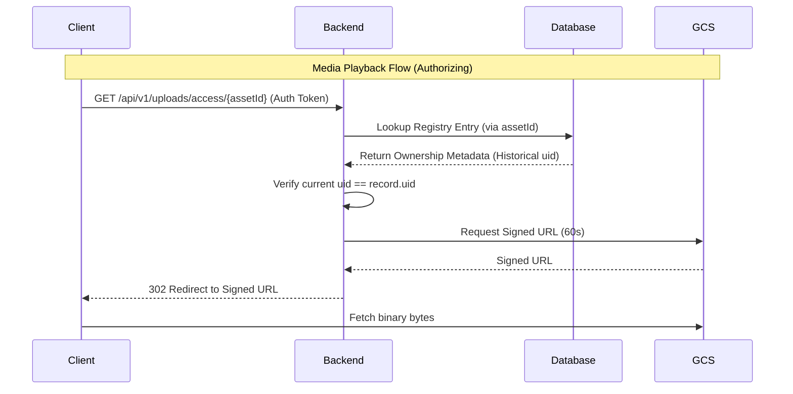

# Storage & Indexing Architecture

This document describes the decoupled identity and indexing strategy used for media assets and analytical data in the AppForge backend.

## 1. Media Storage & Access (PASSPORT Pattern)

The backend uses a "Passport" pattern to manage private media assets in Google Cloud Storage (GCS). This ensures that storage identities are decoupled from business records for enhanced security.

### 1.1 Components

- **Client**: Pre-generates `recordingId`/`imageId` (Business ID) and `assetId` (Storage ID).
- **Backend Admin Metadata Index**: A restricted collection that maps anonymous `assetId`s to trusted `uid`s and GCS paths.
- **GCS (Storage)**: Private binary storage with paths derived from `uid` and `assetId`.
- **Backend Proxy**: An authenticated route that converts an `assetId` into a short-lived GCS Signed URL.

### 1.2 Data Schemas

#### Admin Metadata Index
**Path**: `admin/uploads/metadata/{uploadId}`
| Field | Purpose |
| :--- | :--- |
| `assetId` | The client-generated identifier (UUIDv7). |
| `uid` | Authenticated Owner ID. |
| `objectName` | Full GCS path: `users/{uid}/.../{assetId}.webm` |
| `status` | `pending` | `completed` |
| `type` | `answer_recording` | `bench_prep_image` |

### 1.3 Media Access Flow

---

### 2. Analytics & Dashboard Indexing (Aggregation Flow)

AppForge uses an hourly loop to provide high-performance dashboards without taxing the primary transactional database with complex aggregations.

#### 2.1 The Dashboard Pattern
Instead of running expensive `COUNT` or `SUM` queries on user collections (which would with inefficient queries), we push the hard work to BigQuery:
1. **Source**: User collections (`tasks`, `recordings`, etc.) are mirrored to BigQuery.
2. **Compute**: BigQuery runs hourly SQL views to calculate totals and status distributions.
4. **UI**: The React UI listens to the static dashboard documents for instant loading.

---

## 3. Indexing Matrix (Where & What)

| Role | Collection Path | Write Source | Consistency | Description |
| :--- | :--- | :--- | :--- | :--- |
| **Admin** | `admin/uploads/metadata` | Backend | Atomic | Maps media assets to users for security. |
| **Admin** | `admin/uploads/processed` | Cloud Functions | Eventual | Placeholder for AI/Transcription results. |
| **Admin** | `admin/dodo-payments` | Backend | Atomic | Raw Dodo Payments webhook data and sync state. |
| **Admin** | `admin/audit/billing` | Backend | Immutable | Permanent log of all entitlement changes. |
| **User** | `users/{uid}/billing` | Backend | Atomic | Authority for user subscription/entitlement plus per-feature quotas; backend seeds trial entitlement and manages updates. |
| **User** | `users/{uid}/billing-history` | Backend | Atomic | User-visible transaction log. |
| **User** | `users/{uid}/dashboard/*` | BigQuery | Hourly | Pre-computed stats (Tasks, Recordings, etc). |
| **User** | `users/{uid}/...` | Client | Reactive | Primary business data (Statement, Interviews, etc). |

---

## 4. Security Boundary

- **User Collections**: Accessible via Firebase Security Rules (`request.auth.uid == userId`).
- **Admin Collections**: **Strictly Restricted**. Only accessible via the Backend Service Account (IAM).
- **GCS (Binary)**: Private. Accessible only via Signed URLs issued by the Backend after verifying the Admin Metadata Index.
